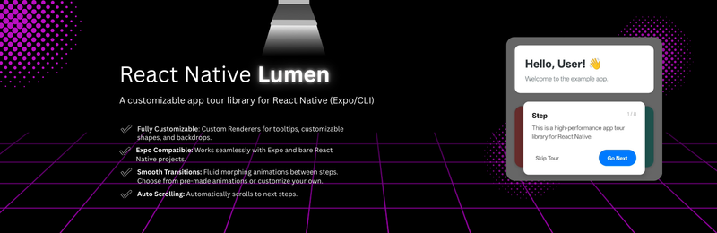

# React Native Lumen 💡

> A high-performance, fully customizable app tour library for React Native, powered by Reanimated 3.



## Demo

<p>
  
</p>

## Features

- ⚡ **High Performance**: Built with `react-native-reanimated` worklets for 60fps animations.
- 🎨 **Fully Customizable**: Custom Renderers for tooltips, customizable shapes, and backdrops.
- 📱 **Expo Compatible**: Works seamlessly with Expo and bare React Native projects.
- 🤸 **Smooth Transitions**: Fluid morphing animations between steps.
- ✨ **Animation Presets**: Ships with beautiful bouncy, gentle, and snappy spring presets.
- 📜 **Auto Scrolling**: Automatically scrolls to next steps.
- 👆 **Interaction Control**: Choose to block or allow interactions with the underlying app.

## Requirements

This library relies on strict peer dependencies to ensure performance:

- `react-native` >= 0.70.0
- `react-native-reanimated` >= 3.0.0
- `react-native-svg` >= 12.0.0
- `react-native-gesture-handler` >= 2.0.0

## Installation

```sh
npm install react-native-lumen react-native-reanimated react-native-svg react-native-gesture-handler react-native-worklets
```

## Usage

1.  **Wrap your App with `TourProvider`**:

```tsx
import { TourProvider } from 'react-native-lumen';

export default function App() {
  return (
    <TourProvider>
      <YourAppContent />
    </TourProvider>
  );
}
```

2.  **Highlight Elements with `TourZone`**:

```tsx
import { TourZone } from 'react-native-lumen';

<TourZone
  stepKey="step-1"
  name="My Feature"
  description="This is an awesome feature you should know about."
  order={1}
  borderRadius={10}
>
  <MyButton />
</TourZone>;
```

3.  **Control the Tour**:

```tsx
import { useTour } from 'react-native-lumen';

const MyComponent = () => {
  const { start } = useTour();
  return <Button title="Start Tour" onPress={() => start()} />;
};
```

## API Documentation

### `TourProvider`

The main context provider. Place this at the root of your application.

| Prop              | Type              | Default     | Description                                              |
| :---------------- | :---------------- | :---------- | :------------------------------------------------------- |
| `children`        | `React.ReactNode` | Required    | Application content.                                     |
| `stepsOrder`      | `string[]`        | `undefined` | Optional array of step keys to define a forced sequence. |
| `backdropOpacity` | `number`          | `0.5`       | Opacity of the dark background overlay (0-1).            |
| `config`          | `TourConfig`      | `undefined` | Global configuration options.                            |

### `TourZone`

Wrapper component to register an element as a tour step.

| Prop           | Type                 | Default     | Description                                     |
| :------------- | :------------------- | :---------- | :---------------------------------------------- |
| `stepKey`      | `string`             | Required    | Unique identifier for the step.                 |
| `name`         | `string`             | `undefined` | Title of the step.                              |
| `description`  | `string`             | Required    | Description text shown in the tooltip.          |
| `order`        | `number`             | `undefined` | Order of appearance (if `stepsOrder` not used). |
| `shape`        | `'rect' \| 'circle'` | `'rect'`    | Shape of the spotlight.                         |
| `borderRadius` | `number`             | `10`        | Border radius of the spotlight.                 |
| `clickable`    | `boolean`            | `false`     | If `true`, the step remains interactive.        |
| `style`        | `ViewStyle`          | `undefined` | Style for the wrapping container.               |

### `TourConfig`

Configuration object needed for `TourProvider`.

```tsx
interface TourConfig {
  /**
   * Animation configuration for the spotlight movement.
   * You can use presets like WigglySpringConfig, GentleSpringConfig etc.
   */
  springConfig?: WithSpringConfig;
  /**
   * If true, prevents interaction with the underlying app while tour is active.
   */
  preventInteraction?: boolean;
  /**
   * Custom labels for buttons.
   */
  labels?: {
    next?: string;
    previous?: string;
    finish?: string;
    skip?: string;
  };
  /**
   * Custom renderer for the card/tooltip.
   */
  renderCard?: (props: CardProps) => React.ReactNode;
  /**
   * Initial overlay opacity. Default 0.5
   */
  backdropOpacity?: number;
}
```

## Customization Guide

### Animation Presets

React Native Lumen comes with built-in Reanimated spring configs for easy usage.

```tsx
import { TourProvider, WigglySpringConfig } from 'react-native-lumen';

<TourProvider config={{ springConfig: WigglySpringConfig }}>...</TourProvider>;
```

### Auto Scroll Support

React Native Lumen supports auto-scrolling to steps that are off-screen. To enable this, simply attach the `scrollViewRef` provided by the hook to your scroll container.

```tsx
import { useTour } from 'react-native-lumen';
import Animated from 'react-native-reanimated';

const MyScrollableScreen = () => {
  const { scrollViewRef } = useTour();

  return (
    <Animated.ScrollView ref={scrollViewRef}>
      {/* ... content with TourZones ... */}
    </Animated.ScrollView>
  );
};
```

> **Note:** The scroll view must be compatible with Reanimated refs (e.g. `Animated.ScrollView`).

Available presets:

- `Reanimated3DefaultSpringConfig`
- `WigglySpringConfig` (Bouncy)
- `GentleSpringConfig` (Smooth)
- `SnappySpringConfig` (Fast & Responsive)
- `and more!`

### Custom Tooltip Card

You can fully replace the default tooltip with your own beautiful UI using the `renderCard` prop in `config`.

```tsx
import { TourProvider, CardProps } from 'react-native-lumen';

const CustomCard = ({
  step,
  next,
  prev,
  stop,
  isLast,
  currentStepIndex,
  totalSteps,
}: CardProps) => (
  <View style={{ padding: 20, backgroundColor: 'white', borderRadius: 20 }}>
    <Text style={{ fontWeight: 'bold', fontSize: 20 }}>{step.name}</Text>
    <Text>{step.description}</Text>
    <Text style={{ color: 'gray' }}>
      Step {currentStepIndex + 1} of {totalSteps}
    </Text>

    <View style={{ flexDirection: 'row', marginTop: 10 }}>
      <Button onPress={stop} title="Close" />
      <View style={{ flex: 1 }} />
      {!isLast ? (
        <Button onPress={next} title="Next" />
      ) : (
        <Button onPress={stop} title="Finish" />
      )}
    </View>
  </View>
);

export default function App() {
  return (
    <TourProvider config={{ renderCard: (props) => <CustomCard {...props} /> }}>
      <AppContent />
    </TourProvider>
  );
}
```

## License

MIT
