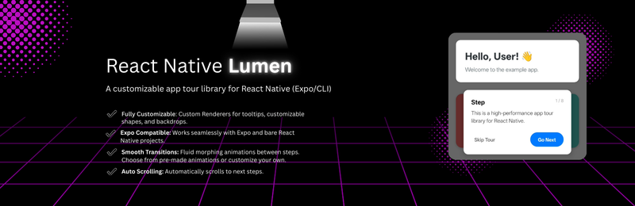

<p align="center">
  <div align="center">
    <a href="https://www.npmjs.com/package/react-native-lumen">
      
    </a>
    <a href="https://www.npmjs.com/package/react-native-lumen">
      
    </a>
    <a href="https://github.com/thedev204/react-native-lumen/blob/main/LICENSE">
      
    </a>
  </div>
  <div align="center">
    <a href="https://github.com/expo/expo">
      
    </a>
    <a href="https://github.com/thedev204/react-native-lumen/issues">
      
    </a>
    <a href="https://semver.org/spec/v2.0.0.html">
      
    </a>
  </div>
</p>

<br/>

<h1 align="center">React Native Lumen 💡</h1>

<p align="center">
  A high-performance, fully customizable app tour library for React Native, powered by Reanimated 3.
</p>

<p align="center">
  
</p>

## Demo

<p>
  
  
</p>

---

## Requirements

| Package                        | Version   |
| :----------------------------- | :-------- |
| `react-native`                 | >= 0.70.0 |
| `react-native-reanimated`      | >= 3.0.0  |
| `react-native-svg`             | >= 12.0.0 |
| `react-native-gesture-handler` | >= 2.0.0  |

## Installation

```sh
npm install react-native-lumen react-native-reanimated react-native-svg react-native-gesture-handler react-native-worklets
```

```sh
yarn add react-native-lumen react-native-reanimated react-native-svg react-native-gesture-handler react-native-worklets
```

## Quick Start

```tsx
import {
  TourProvider,
  TourZone,
  useTour,
  SnappySpringConfig,
} from 'react-native-lumen';

// 1. Wrap your app
export default function App() {
  return (
    <TourProvider
      stepsOrder={['feature-1', 'feature-2']}
      config={{ springConfig: SnappySpringConfig, enableGlow: true }}
    >
      <YourApp />
    </TourProvider>
  );
}

// 2. Highlight elements
<TourZone
  stepKey="feature-1"
  name="My Feature"
  description="This is a cool feature."
  order={1}
>
  <MyButton />
</TourZone>;

// 3. Control the tour
const { start } = useTour();
<Button title="Start Tour" onPress={() => start()} />;
```

## Documentation

Full API reference, guides, and examples are available on the **[official documentation website](https://thedev204.github.io/react-native-lumen/)**.

- [Getting Started](https://thedev204.github.io/react-native-lumen/docs/getting-started)
- [TourProvider](https://thedev204.github.io/react-native-lumen/docs/api/tour-provider)
- [TourZone](https://thedev204.github.io/react-native-lumen/docs/api/tour-zone)
- [useTour Hook](https://thedev204.github.io/react-native-lumen/docs/api/use-tour)
- [Multi-Screen Tours](https://thedev204.github.io/react-native-lumen/docs/guides/multi-screen-tours)
- [Persistence](https://thedev204.github.io/react-native-lumen/docs/guides/persistence)

## Changelog

See [CHANGELOG.md](./CHANGELOG.md) for release history.

## Contributing

Contributions are welcome! Please read [CONTRIBUTING.md](./CONTRIBUTING.md) before submitting a pull request.

- Report bugs in the [Issue Tracker](https://github.com/thedev204/react-native-lumen/issues).

## License

MIT